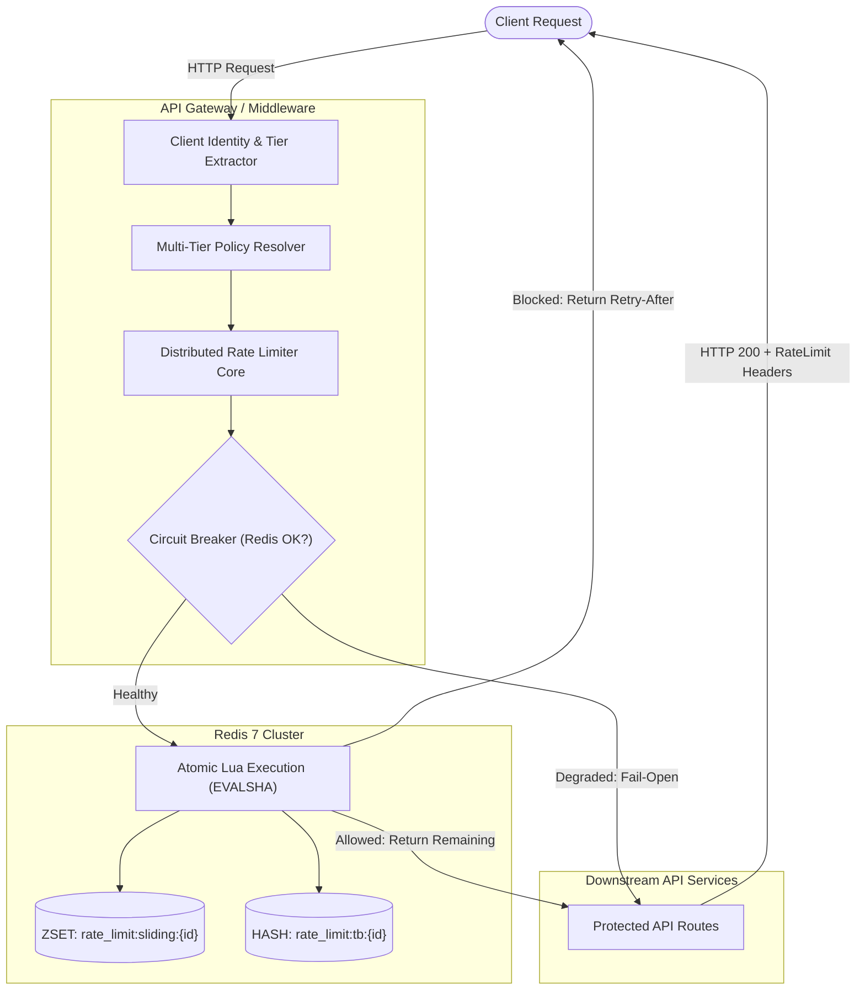

# System Architecture & Technical Design

## 1. High-Level Architecture Overview

The **Distributed Rate Limiter Gateway** enforces traffic quotas across distributed API server clusters without allowing race-condition quota leaks.



---

## 2. Algorithmic Deep Dive: Token Bucket vs. Sliding Window

### 1. Token Bucket Algorithm
* **Characteristics:** Accommodates bursty traffic up to a maximum bucket capacity ($C$) while enforcing a smooth average consumption rate ($R$ tokens/second).
* **Storage Model:** Redis Hash storing `{tokens, last_updated}`.
* **Mathematical Ingestion:**
  $$\text{tokens}_{\text{new}} = \min(C, \text{tokens}_{\text{old}} + (t_{\text{now}} - t_{\text{last}}) \times R)$$
* **Advantage:** Space complexity is $O(1)$ constant memory per client key. Ideal for public REST APIs and third-party developer platforms.

### 2. Sliding Window Log Algorithm
* **Characteristics:** Strict rolling-window traffic shaping. Eliminates the **boundary burst attack** common in Fixed Window algorithms (where a client exhausts 2x their quota at window reset points).
* **Storage Model:** Redis Sorted Set (ZSET) where scores and values are timestamps in milliseconds.
* **Mathematical Ingestion:**
  $$\text{active\_requests} = |\{t \in \text{ZSET} \mid t > t_{\text{now}} - W\}|$$
* **Advantage:** Precision guarantees 0% over-limit bursts at rolling boundaries.

---

## 3. Why Redis Lua Scripts Eliminate Distributed Race Conditions

In high-throughput microservices, dozens of API gateway workers receive requests for the same client in the exact same millisecond:

```
Worker 1: GET count -> 99 (Allowed)
Worker 2: GET count -> 99 (Allowed)
Worker 1: INCR -> 100
Worker 2: INCR -> 101  <-- OVER-QUOTA LEAK!
```

### The Atomic Solution
Redis executes Lua scripts single-threaded and atomically. No other command or script can run while a Lua script executes on Redis. By executing the entire read-compute-write sequence inside `EVALSHA`, race conditions are completely eliminated with sub-millisecond execution time.

---

## 4. RFC 6585 & IETF RateLimit Header Specification

Responses adhere strictly to the IETF RateLimit Header specification:

| Header | Description | Example |
| :--- | :--- | :--- |
| `RateLimit-Limit` | Request quota allocated in the active window | `60` |
| `RateLimit-Remaining` | Remaining requests allowed | `42` |
| `RateLimit-Reset` | Window rollover / seconds until reset | `18` |
| `RateLimit-Policy` | Active quota and window policy | `60;w=60;algo=token_bucket` |
| `Retry-After` | Required wait duration on HTTP 429 response | `18` |

---

## 5. High Availability & Fail-Open Circuit Breaker

Downstream business availability takes precedence over strict rate limiting during infrastructure degradation:
- If Redis client calls exceed 50ms or raise connection timeouts, the circuit breaker triggers a **Fail-Open** state.
- Traffic is passed downstream with a warning metric `rate_limit_degraded_total`, preventing Redis infrastructure outages from taking down client-facing services.
